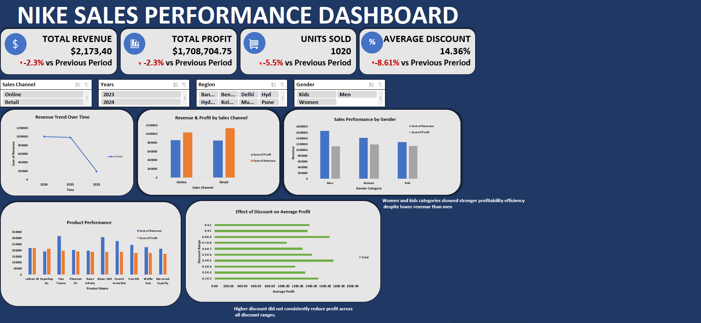

# Nike Sales Analysis
## Overview
Analysis of Nike sales data using SQL and Excel to uncover revenue trends, profitability insights and sales performance across regions, products and gender categories.
## Tools Used
- MySQL — Data cleaning & Exploratory Data Analysis (EDA)
- Excel — Interactive dashboard & data visualization
## Key Insights
- High revenue does not always mean high profitability
- Women and Kids categories showed stronger profit efficiency despite lower revenue than Men
- Higher discounts did not consistently reduce profit across all discount ranges
## Files
nike_sales_analysis.sql — Data cleaning and Exploratory Data Analysis
## Dashboard Preview

