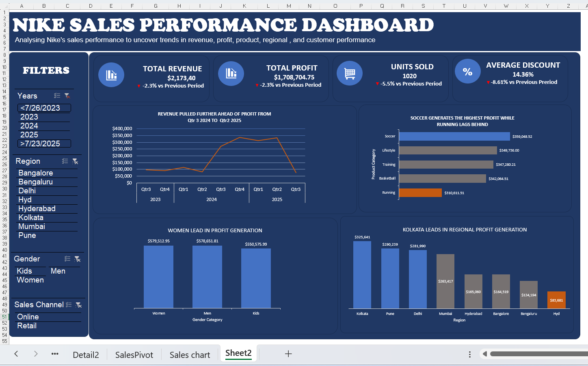

# Nike Sales Performance Analysis

## Objective
To analyze Nike sales performance, identify revenue and profitability trends, evaluate product and regional performance, and build an interactive dashboard for business insights.

## Overview
Analysis of Nike sales data using SQL and Excel to uncover revenue trends, profitability insights and sales performance across regions, products and gender categories.

## Business Questions
- Which year generated the highest sales?
- Which products were most profitable?
- Which category performed best?
- How did discounts affect profitability?
- Which regions had the strongest performance?

## Tools Used
- MySQL — Data cleaning & Exploratory Data Analysis (EDA)
- Excel — Interactive dashboard & data visualization

## Process
1. Data Cleaning in SQL
2. Exploratory Data Analysis (EDA)
3. Data Export to Excel
4. Dashboard Creation
5. Insights & Recommendations

## Key Insights
- High revenue does not always mean high profitability
- Women and Kids categories showed stronger profit efficiency despite lower revenue than Men
- Higher discounts did not consistently reduce profit across all discount ranges

## Recommendations
- Review Men category expenses to improve profitability
- Improve low performing retail regions
- Investigate negative unit sales from returns and cancellations

## Files
- nike_sales_analysis.sql — Data cleaning and Exploratory Data Analysis

## Dashboard Preview

